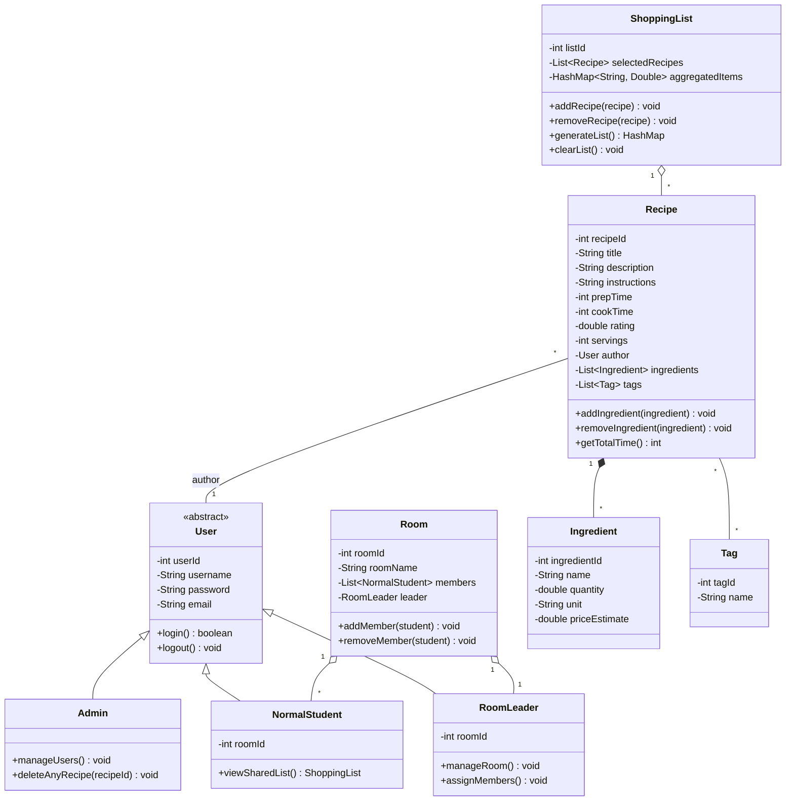

# VinRECIPE — Project Outline

> **Mục đích**: File này là bản outline chi tiết để team bám sát trong quá trình code.
> Dựa trên [proposal.md](file:///a:/Spring_2026/github_repo/Project_OOP/proposal.md).

---

## 1. Tổng quan kiến trúc

```
┌─────────────────────────────────────────────────┐
│                   JavaFX GUI                    │
│         (Views / FXML + Controllers)            │
├─────────────────────────────────────────────────┤
│                Service Layer                    │
│   (RecipeService, ShoppingListService, ...)     │
├─────────────────────────────────────────────────┤
│              DAO / Repository Layer             │
│     (RecipeDAO, IngredientDAO, UserDAO, ...)    │
├─────────────────────────────────────────────────┤
│                  Model Layer                    │
│  (User, Recipe, Ingredient, Tag, Room, ...)     │
├─────────────────────────────────────────────────┤
│               MySQL Database                    │
└─────────────────────────────────────────────────┘
```

**Nguyên tắc**: Tách rõ 4 tầng — **Model → DAO → Service → View/Controller**. Controller không truy cập DB trực tiếp, luôn đi qua Service → DAO.

---

## 2. Cấu trúc thư mục đề xuất

```
Project_OOP/
├── src/
│   └── main/
│       ├── java/
│       │   └── com/vinrecipe/
│       │       ├── App.java                  # Entry point (Application.launch)
│       │       │
│       │       ├── model/                    # --- POJO / Data classes ---
│       │       │   ├── User.java             # Abstract base class
│       │       │   ├── Admin.java            # extends User
│       │       │   ├── NormalStudent.java     # extends User
│       │       │   ├── RoomLeader.java        # extends User
│       │       │   ├── Room.java
│       │       │   ├── Recipe.java
│       │       │   ├── Ingredient.java
│       │       │   ├── Tag.java
│       │       │   └── ShoppingList.java
│       │       │
│       │       ├── dao/                      # --- Data Access (JDBC) ---
│       │       │   ├── DatabaseConnection.java
│       │       │   ├── UserDAO.java
│       │       │   ├── RecipeDAO.java
│       │       │   ├── IngredientDAO.java
│       │       │   └── TagDAO.java
│       │       │
│       │       ├── service/                  # --- Business Logic ---
│       │       │   ├── RecipeService.java
│       │       │   ├── ShoppingListService.java
│       │       │   ├── SearchService.java
│       │       │   └── UserService.java
│       │       │
│       │       └── controller/               # --- JavaFX Controllers ---
│       │           ├── LoginController.java
│       │           ├── DashboardController.java
│       │           ├── RecipeFormController.java
│       │           ├── RecipeDetailController.java
│       │           ├── SearchController.java
│       │           └── ShoppingListController.java
│       │
│       └── resources/
│           ├── fxml/                         # --- FXML layouts ---
│           │   ├── login.fxml
│           │   ├── dashboard.fxml
│           │   ├── recipe_form.fxml
│           │   ├── recipe_detail.fxml
│           │   ├── search.fxml
│           │   └── shopping_list.fxml
│           │
│           ├── css/
│           │   └── style.css
│           │
│           └── db/
│               └── schema.sql                # DDL script tạo bảng
│
├── pom.xml                                   # Maven config (JavaFX + MySQL connector)
├── proposal.md
├── CLAUDE.md
└── README.md
```

---

## 3. Class Diagram (UML tóm tắt)



---

## 4. Database Schema (MySQL)

```sql
-- ========== USERS ==========
CREATE TABLE users (
    user_id     INT AUTO_INCREMENT PRIMARY KEY,
    username    VARCHAR(50)  NOT NULL UNIQUE,
    password    VARCHAR(255) NOT NULL,
    email       VARCHAR(100) NOT NULL UNIQUE,
    role        ENUM('ADMIN', 'NORMAL_STUDENT', 'ROOM_LEADER') NOT NULL DEFAULT 'NORMAL_STUDENT',
    room_id     INT,
    created_at  TIMESTAMP DEFAULT CURRENT_TIMESTAMP
);

-- ========== ROOMS ==========
CREATE TABLE rooms (
    room_id     INT AUTO_INCREMENT PRIMARY KEY,
    room_name   VARCHAR(100) NOT NULL,
    leader_id   INT,
    FOREIGN KEY (leader_id) REFERENCES users(user_id)
);

ALTER TABLE users ADD FOREIGN KEY (room_id) REFERENCES rooms(room_id);

-- ========== TAGS ==========
CREATE TABLE tags (
    tag_id   INT AUTO_INCREMENT PRIMARY KEY,
    name     VARCHAR(50) NOT NULL UNIQUE
);

-- ========== RECIPES ==========
CREATE TABLE recipes (
    recipe_id    INT AUTO_INCREMENT PRIMARY KEY,
    title        VARCHAR(200) NOT NULL,
    description  TEXT,
    instructions TEXT,
    prep_time    INT,          -- in minutes
    cook_time    INT,          -- in minutes
    rating       DECIMAL(2,1) DEFAULT 0.0,
    servings     INT DEFAULT 1,
    author_id    INT,
    created_at   TIMESTAMP DEFAULT CURRENT_TIMESTAMP,
    FOREIGN KEY (author_id) REFERENCES users(user_id)
);

-- ========== INGREDIENTS ==========
CREATE TABLE ingredients (
    ingredient_id  INT AUTO_INCREMENT PRIMARY KEY,
    recipe_id      INT NOT NULL,
    name           VARCHAR(100) NOT NULL,
    quantity       DECIMAL(10,2),
    unit           VARCHAR(30),
    price_estimate DECIMAL(10,2),
    FOREIGN KEY (recipe_id) REFERENCES recipes(recipe_id) ON DELETE CASCADE
);

-- ========== RECIPE ↔ TAG (many-to-many) ==========
CREATE TABLE recipe_tags (
    recipe_id  INT,
    tag_id     INT,
    PRIMARY KEY (recipe_id, tag_id),
    FOREIGN KEY (recipe_id) REFERENCES recipes(recipe_id) ON DELETE CASCADE,
    FOREIGN KEY (tag_id)    REFERENCES tags(tag_id) ON DELETE CASCADE
);

-- ========== SHOPPING LISTS ==========
CREATE TABLE shopping_lists (
    list_id     INT AUTO_INCREMENT PRIMARY KEY,
    user_id     INT NOT NULL,
    created_at  TIMESTAMP DEFAULT CURRENT_TIMESTAMP,
    FOREIGN KEY (user_id) REFERENCES users(user_id)
);

CREATE TABLE shopping_list_recipes (
    list_id   INT,
    recipe_id INT,
    PRIMARY KEY (list_id, recipe_id),
    FOREIGN KEY (list_id)   REFERENCES shopping_lists(list_id) ON DELETE CASCADE,
    FOREIGN KEY (recipe_id) REFERENCES recipes(recipe_id) ON DELETE CASCADE
);
```

---

## 5. Chi tiết từng tầng

### 5.1 Model Layer (`model/`)

| Class | Vai trò | OOP Concept |
|---|---|---|
| `User` (abstract) | Chứa `userId`, `username`, `password`, `email`. Khai báo abstract method nếu cần | **Abstraction** |
| `Admin` | Extends `User`. Thêm quyền quản lý user, xóa recipe của người khác | **Inheritance** |
| `NormalStudent` | Extends `User`. Có `roomId`, xem shared list | **Inheritance** |
| `RoomLeader` | Extends `User`. Quản lý phòng, phân công | **Inheritance** |
| `Room` | Chứa `List<NormalStudent>`, `RoomLeader` | **Composition** |
| `Recipe` | `private List<Ingredient>`, `private List<Tag>`, getters/setters có validation | **Encapsulation** |
| `Ingredient` | POJO: name, quantity, unit, priceEstimate | **Encapsulation** |
| `Tag` | POJO: tagId, name | |
| `ShoppingList` | Chứa `HashMap<String, Double>` để aggregate ingredients | **HashMap usage** |

> [!IMPORTANT]
> Tất cả field trong model phải là `private` + public getter/setter có validation. Đây là yêu cầu OOP bắt buộc của đề bài.

### 5.2 DAO Layer (`dao/`)

Mỗi DAO class chịu trách nhiệm **CRUD** cho 1 bảng trong MySQL.

| Class | Chức năng chính |
|---|---|
| `DatabaseConnection` | Singleton, quản lý `Connection` đến MySQL |
| `RecipeDAO` | `insert()`, `findById()`, `findAll()`, `update()`, `delete()`, `searchByTitle()`, `searchByTag()` |
| `IngredientDAO` | `insertForRecipe()`, `findByRecipeId()`, `deleteByRecipeId()` |
| `UserDAO` | `insert()`, `findByUsername()`, `authenticate()` |
| `TagDAO` | `insert()`, `findAll()`, `findByRecipeId()` |

**Pattern**: Sử dụng `PreparedStatement` để tránh SQL injection. Mỗi method mở/đóng connection hoặc dùng try-with-resources.

### 5.3 Service Layer (`service/`)

| Class | Logic chính |
|---|---|
| `RecipeService` | Gọi `RecipeDAO` + `IngredientDAO` + `TagDAO`. Xử lý logic tạo/sửa recipe kèm ingredients. |
| `SearchService` | **Inverted Index**: build index `Map<String, List<Recipe>>` từ ingredient name → recipes. Tìm recipe khớp nhiều ingredient nhất → nếu bằng nhau thì chọn `prepTime` thấp nhất. Dùng `HashSet` lọc unique tags cho dropdown. |
| `ShoppingListService` | Nhận `List<Recipe>` → duyệt tất cả ingredients → dùng `HashMap<String, Double>` để cộng dồn quantity cùng tên → trả về consolidated list. |
| `UserService` | Login/register logic, hash password. |

### 5.4 Controller + View Layer (`controller/` + `resources/fxml/`)

| Screen | FXML | Controller | Mô tả |
|---|---|---|---|
| Đăng nhập | `login.fxml` | `LoginController` | Form username/password, nút Login/Register |
| Dashboard | `dashboard.fxml` | `DashboardController` | Hiển thị list recipes (ListView/GridPane), nút Add, Search, Shopping List |
| Thêm/Sửa Recipe | `recipe_form.fxml` | `RecipeFormController` | Form nhập title, description, instructions, thêm ingredients (TableView), chọn tags |
| Chi tiết Recipe | `recipe_detail.fxml` | `RecipeDetailController` | Hiển thị đầy đủ thông tin recipe, nút Edit/Delete |
| Tìm kiếm | `search.fxml` | `SearchController` | TextField tìm theo title, ComboBox filter theo tag, kết quả bên dưới |
| Shopping List | `shopping_list.fxml` | `ShoppingListController` | Chọn nhiều recipe (CheckBox) → Generate → hiển thị danh sách mua sắm |

---

## 6. Thuật toán chính

### 6.1 Inverted Index Search (tìm recipe theo nguyên liệu có sẵn)

```
Input:  userIngredients = ["chicken", "garlic", "rice"]

Bước 1 — Build Inverted Index (chạy 1 lần khi load):
    invertedIndex = {
        "chicken" → [Recipe_A, Recipe_C],
        "garlic"  → [Recipe_A, Recipe_B, Recipe_C],
        "rice"    → [Recipe_A, Recipe_D],
        "beef"    → [Recipe_B],
        ...
    }

Bước 2 — Tìm kiếm:
    Với mỗi ingredient user có → lấy danh sách recipes từ index
    Đếm số lần mỗi recipe xuất hiện → matchCount

    matchCount = {
        Recipe_A → 3,   (chicken + garlic + rice)
        Recipe_B → 1,   (garlic)
        Recipe_C → 2,   (chicken + garlic)
        Recipe_D → 1,   (rice)
    }

Bước 3 — Tính completion percentage:
    completion = matchCount / recipe.totalIngredients * 100

Bước 4 — Sắp xếp:
    Sort by completion DESC, rồi prepTime ASC (nếu bằng nhau)

Output: Danh sách recipes xếp hạng theo mức độ phù hợp
```

**Data structure**: `HashMap<String, List<Recipe>>` cho inverted index, `HashMap<Recipe, Integer>` cho matchCount.

### 6.2 Shopping List Aggregation

```
Input:  selectedRecipes = [Recipe_A (2 servings), Recipe_B (1 serving)]

Recipe_A: chicken 500g, rice 300g, garlic 20g
Recipe_B: chicken 200g, soy_sauce 30ml, garlic 10g

Bước 1 — Iterate tất cả ingredients:
    aggregated = HashMap<String, Double>
    Với mỗi recipe → với mỗi ingredient:
        aggregated.merge(name, quantity, Double::sum)

Bước 2 — Kết quả:
    aggregated = {
        "chicken"   → 700.0 (g),
        "rice"      → 300.0 (g),
        "garlic"    → 30.0  (g),
        "soy_sauce" → 30.0  (ml)
    }

Output: Danh sách gộp, hiển thị trên GUI
```

### 6.3 Sorting

Dùng `Collections.sort()` hoặc `List.sort()` với `Comparator`:
- Sort by **rating** (DESC)
- Sort by **prepTime** (ASC)
- Sort by **price estimate** (ASC) — tính tổng `priceEstimate` của ingredients

---

## 7. Data Structures sử dụng

| Data Structure | Nơi sử dụng | Mục đích |
|---|---|---|
| `ArrayList<Recipe>` | RecipeDAO, SearchService | Lưu danh sách recipes trả về từ DB |
| `ArrayList<Ingredient>` | Recipe model | Lưu danh sách nguyên liệu của recipe |
| `HashSet<String>` | SearchService | Lọc unique tag names cho ComboBox filter |
| `HashMap<String, Double>` | ShoppingListService | Gộp ingredient cùng tên, cộng dồn quantity |
| `HashMap<String, List<Recipe>>` | SearchService (Inverted Index) | Map ingredient name → list of recipes chứa nó |
| `HashMap<Recipe, Integer>` | SearchService | Đếm matchCount cho ranking |

---

## 8. OOP Concepts thể hiện

| Concept | Nơi thể hiện |
|---|---|
| **Inheritance** | `Admin`, `NormalStudent`, `RoomLeader` kế thừa từ `User` |
| **Encapsulation** | Tất cả model fields `private` + public getters/setters có validation |
| **Polymorphism** | Override method trong các subclass của `User` (vd: permissions khác nhau) |
| **Abstraction** | `User` là abstract class, có thể tạo interface `Searchable` nếu cần |
| **Composition** | `Recipe` chứa `List<Ingredient>`, `Room` chứa `List<NormalStudent>` |

---

## 9. Phân chia công việc đề xuất (5 thành viên)

| Thành viên | Phụ trách | Files chính |
|---|---|---|
| **Nhan** (Leader) | Kiến trúc tổng, DAO layer, Database | `DatabaseConnection`, `RecipeDAO`, `IngredientDAO`, `schema.sql` |
| **Trang** | Model layer + User system | `User`, `Admin`, `NormalStudent`, `RoomLeader`, `Room`, `UserDAO`, `UserService` |
| **Nguyen** | Recipe Service + Search (Inverted Index) | `RecipeService`, `SearchService`, inverted index algorithm |
| **Kiet** | JavaFX GUI (FXML + Controllers) | Tất cả file `.fxml`, `LoginController`, `DashboardController`, `style.css` |
| **Phuong** | Shopping List feature + Testing | `ShoppingList`, `ShoppingListService`, `ShoppingListController`, unit tests |

---

## 10. Milestones theo Timeline

### Phase 3: Design (3/4 – 12/4) ✅
- [x] UML class diagram
- [x] Database schema
- [x] UI mockups

### Phase 4: Implementation (13/4 – 20/5)
- [ ] **Tuần 1-2**: Setup Maven project, tạo DB, code Model layer + DAO layer
- [ ] **Tuần 3**: Service layer (RecipeService, UserService)
- [ ] **Tuần 4**: JavaFX GUI cơ bản (Login, Dashboard, Recipe CRUD)
- [ ] **Tuần 5**: SearchService (Inverted Index) + ShoppingListService
- [ ] **Tuần 6**: Kết nối GUI ↔ Service, hoàn thiện flow

### Phase 5: Refactoring (21/5 – 25/5)
- [ ] Optimize code, clean up
- [ ] Cải thiện UI/UX
- [ ] Thêm tính năng phụ nếu kịp

### Phase 6: Testing (26/5 – 30/5)
- [ ] Unit test cho Service layer
- [ ] Integration test (GUI ↔ DB)
- [ ] Fix bugs

### Phase 7: Finalization (31/5 – 2/6)
- [ ] Viết báo cáo
- [ ] Chuẩn bị slides + demo

---

## 11. Dependencies (pom.xml)

```xml
<dependencies>
    <!-- JavaFX -->
    <dependency>
        <groupId>org.openjfx</groupId>
        <artifactId>javafx-controls</artifactId>
        <version>21</version>
    </dependency>
    <dependency>
        <groupId>org.openjfx</groupId>
        <artifactId>javafx-fxml</artifactId>
        <version>21</version>
    </dependency>

    <!-- MySQL Connector -->
    <dependency>
        <groupId>com.mysql</groupId>
        <artifactId>mysql-connector-j</artifactId>
        <version>8.3.0</version>
    </dependency>

    <!-- JUnit 5 (testing) -->
    <dependency>
        <groupId>org.junit.jupiter</groupId>
        <artifactId>junit-jupiter</artifactId>
        <version>5.10.2</version>
        <scope>test</scope>
    </dependency>
</dependencies>
```

---

## Open Questions

> [!IMPORTANT]
> **Cần team xác nhận trước khi code:**
> 1. **Build tool**: Dùng **Maven** hay **Gradle**? (Outline này đang assume Maven)
> 2. **Java version**: Team dùng Java mấy? (Recommend Java 17+ cho JavaFX 21)
> 3. **MySQL**: Mỗi người tự cài local hay dùng chung 1 server? Cần thống nhất credentials.
> 4. **Password**: Có cần hash password (BCrypt) hay lưu plain text cho đơn giản (vì là project học)?
> 5. **Unit handling**: Khi aggregate shopping list, nếu cùng ingredient nhưng khác unit (vd: 500g vs 0.5kg) thì xử lý thế nào?
